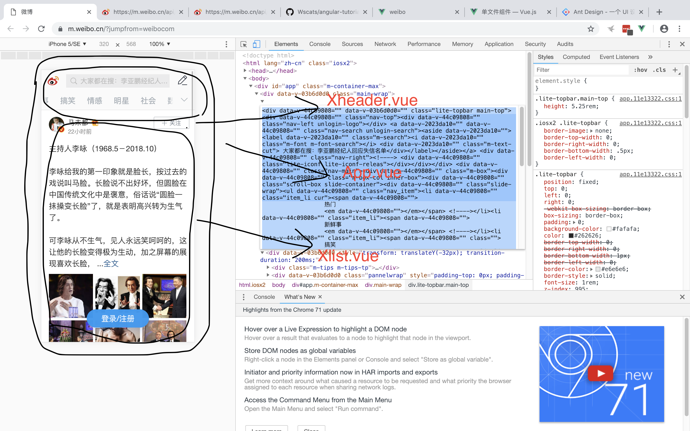
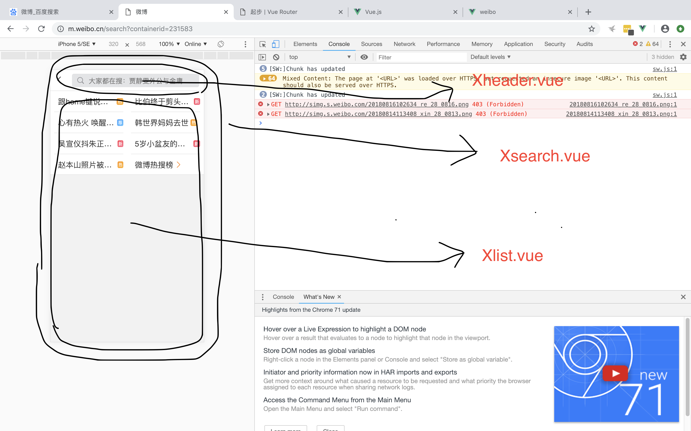

# 组件




```
App.vue/Home.vue(父) = Xheader.vue(子) + Xlist.vue(子)
```

# 路由



```
Search.vue(父) = Xheader.vue(子) + Xlist.vue(子)
```
后端是进去不同路径，返回不同的数据

前端是进去不同路径，显示不同的页面内容

1. 安装路由模块
```
npm install vue-router --save-dev
```

2. 把以下代码放进main.js文件里面
```js
import VueRouter from 'vue-router'
Vue.use(VueRouter)
```
3. 定义路由配置参数

如果url的路径为`/home`,在页面显示Home组件(里面包含着子组件)

反之如果路径为`/search`,在页面显示Search组件(里面包含着子组件)
```js
// 1. 定义 (路由) 组件。
// 可以从其他文件 import 进来
import Home from "./container/Home.vue";
import Search from "./container/Search.vue";

// 2. 定义路由
// 每个路由应该映射一个组件。 其中"component" 可以是
// 通过 Vue.extend() 创建的组件构造器，
// 或者，只是一个组件配置对象。
// 我们晚点再讨论嵌套路由。

const routes = [
  { path: '/home', component: Home },
  { path: '/search', component:Search }
]
// 3. 创建 router 实例，然后传 `routes` 配置
// 你还可以传别的配置参数, 不过先这么简单着吧。
const router = new VueRouter({
  routes // (缩写) 相当于 routes: routes
})
```

4. 把router注入到大容器`new Vue`
```js
new Vue({
  router,
  render: h => h(App)
}).$mount('#app')
```

5. 在页面放入`<router-view></router-view>`


> vuecli  vue  vue-router vuex  es6  axios sass  bootstrap  express  mongodb 

# vuex

```
https://vuex.vuejs.org/zh/
```

## 安装

```bash
npm install vuex --save
```

# 引入

```js
import Vue from 'vue'
import Vuex from 'vuex'
Vue.use(Vuex)
```

vuex组件和组件之间的中介

